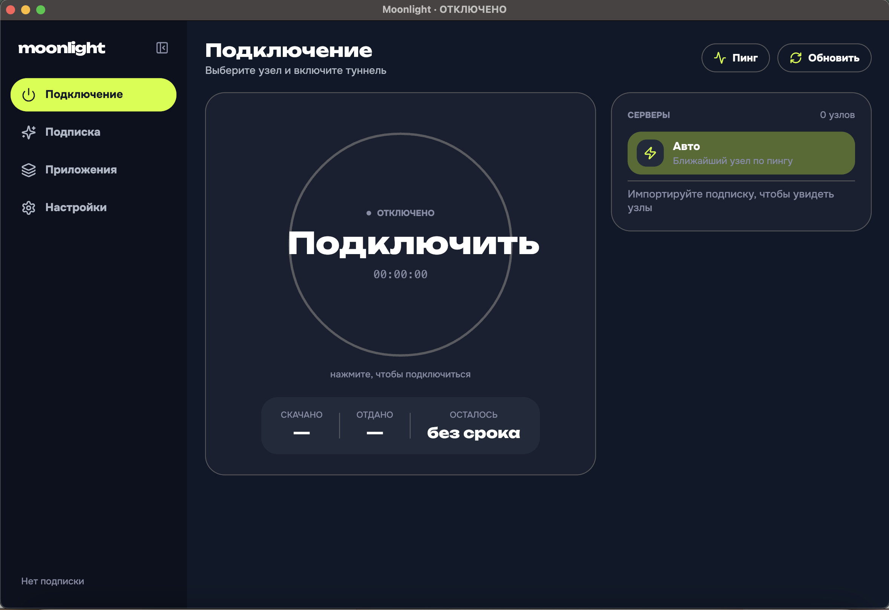

# Moonlight VPN — Windows

A Rust client built on **[mihomo](https://github.com/MetaCubeX/mihomo) 1.19.29**,
implementing the `Moonlight Desktop` design. Subscriptions come from a Remnawave
panel. Companion to [moonlightvpn_macos](https://github.com/kiineld/moonlightvpn_macos),
which is the same product in SwiftUI, and to
[moonlightvpn_android](https://github.com/kiineld/moonlightvpn_android), which is
the same product on Xray-core.



> **Status: the foundation is complete and the app runs; four screens and the
> tunnel controller are not wired up yet.** See [What is not done
> yet](#what-is-not-done-yet) before you install this expecting a working VPN.
>
> The screenshot above is the real app, built and run from the repository — on
> macOS, because iced runs there too and Windows hardware was not to hand. It is
> the same binary and the same widget tree Windows builds.

## Architecture

```
moonlight-design   colour/type/motion tokens, lucide icons, an SVG path renderer
moonlight-core     mihomo supervisor, RESTful API client, config builder,
                   subscription client, system proxy, helper protocol
moonlight          iced screens, view models, the app itself
moonlight-helper   the LocalSystem Windows service that runs the core in TUN mode
```

`moonlight → moonlight-core, moonlight-design` · `moonlight-helper → moonlight-core`.

One Cargo workspace, no solution file, no MSBuild. `scripts\build.ps1` fetches
the assets, builds the release binaries and lays out a portable folder.

### Why Rust and iced

The design is drawn entirely from scratch — there is not one native control on
any screen — so a retained-mode canvas toolkit costs nothing and buys pixel
control. iced also runs on macOS and Linux, which means the UI can be built and
looked at away from Windows, and `cargo check --target x86_64-pc-windows-msvc`
type-checks every `#[cfg(windows)]` block from any machine. That is why
`reqwest` uses **native-tls** rather than rustls: rustls pulls in `ring`, whose
C build breaks cross-checking, and on Windows native-tls *is* schannel, so a
corporate root the machine already trusts works with no CA bundle shipped.

### The data path

```
app traffic → WinINET proxy or Wintun → mihomo → VLESS/Trojan/SS node
                                          ↑
                          app ── RESTful API on 127.0.0.1:9797
```

The core is never reconfigured by restarting it. Switching a node, changing the
split mode, or loading a refreshed subscription all go through the API or a
config reload, so the tunnel survives every one of them.

## Two ways traffic reaches the tunnel

These are different mechanisms, not a preference.

| | System proxy | TUN |
|---|---|---|
| Privileges | none | Administrator, via a service installed once |
| Captures | apps that honour the WinINET proxy | everything |
| Per-app rules | **no** | yes |

### The system proxy needs more than a registry write

macOS's `networksetup` takes effect the moment it returns. Windows does not.
WinINET caches the proxy configuration **per process**, so an application that
is already running keeps going direct until it is told to re-read the settings.
`InternetSetOptionW(INTERNET_OPTION_SETTINGS_CHANGED)` followed by
`INTERNET_OPTION_REFRESH` is that broadcast. Without it the registry says
"proxied" while every browser already open is still going direct — which is
worse than failing, because the UI reports a tunnel that only captures
applications started afterwards.

Three smaller Windows specifics, each of which silently breaks the tunnel if
missed:

- **`AutoConfigURL` is cleared on connect and restored verbatim.** A PAC script
  takes precedence over the manual proxy settings, so on a machine configured by
  group policy the write would otherwise be a no-op.
- **`ProxyServer` names `http=` and `https=` explicitly.** The bare `host:port`
  form is read as HTTP-only by some applications, which leaves HTTPS going
  direct.
- **The bypass list uses `<local>`.** That is WinINET's own token for "any
  hostname with no dot". `*.local` is the macOS spelling and matches nothing
  here.

The previous settings are snapshotted before the first write and put back
verbatim on disconnect — a machine may already have had a proxy the user set by
hand, and restoring "off" unconditionally would silently delete it. The snapshot
is **persisted**, not just held in memory, because a crash that skips the
disconnect path otherwise leaves every browser pointed at a core that is no
longer running: the user sees "the internet stopped working" with nothing on
screen connecting it to this app.

### The helper's trust boundary

TUN needs Administrator — creating the Wintun adapter and installing
`auto-route`'s routes both do, and no manifest work changes that. Asking for a
UAC prompt on every connect is how people end up leaving TUN off, so the
privilege is taken once by a service and held.

A LocalSystem service taking instructions over a pipe is a privilege escalation
waiting to happen, so it is deliberately narrow — the same three rules the macOS
client's LaunchDaemon follows:

- **It never runs a path the client supplies.** The core is a copy made into
  `%ProgramData%\Moonlight` at install time, and that path is compiled into the
  service. The protocol has no field for naming another one, and there is a test
  that fails if one is ever added.
- **It never opens a config path the client supplies.** The client sends config
  *text*; the service writes it into its own directory — and unlinks first,
  because `File::create` follows an existing junction and would otherwise turn
  "start the tunnel" into an arbitrary LocalSystem file write.
- **The pipe's DACL is `D:(A;;GA;;;BA)(A;;GA;;;SY)`** — Administrators and
  SYSTEM, nothing else. That *is* the authentication: there is no token and no
  handshake because the kernel enforces the DACL on `CreateFile`. It is the
  counterpart of the macOS socket's `0660 root:admin`, and like it, it is not a
  boundary against an administrator and does not pretend to be.

The service is **AutoStart, not OnDemand**. The app is not elevated and cannot
start a stopped service, so on-demand would give TUN exactly one working session
per reboot and then fail silently with no way back without another prompt.

### The core cannot outlive the app

On macOS a child dies with its parent's process group. Windows has no such
relationship: an app killed from Task Manager leaves a core still holding the
controller port and still carrying traffic with no UI attached, and the next
launch finds a core it did not start — so every API call silently addresses the
old one. The child is therefore put in a **job object** with
`JOB_OBJECT_LIMIT_KILL_ON_JOB_CLOSE`, which makes the kernel terminate it when
this process exits for any reason, crashes included.

The core also runs with `CREATE_NO_WINDOW`: mihomo is a console application, and
spawning it normally puts a `conhost` window in front of the user for the life
of the tunnel.

### When TUN cannot start

`auto-route` installs routes covering the internet, and another VPN client
holding them makes the core log a `Start TUN listening error` and then **keep
running** — answering its API normally with no interface established, so every
other signal says "connected" while nothing is routed. The connect path checks
the log for that line before reporting success, and names the cause rather than
quoting the core. The Windows-specific case, a Wintun adapter that could not be
created, points at the privilege it needs instead of the API call that failed.

## Split tunnelling

Two ways in to one list of rules. The app toggles are a convenience over
`PROCESS-NAME`, matched on the **executable name with its extension** —
`chrome.exe`, not `chrome`, because that is the string mihomo reads back out of
the process table. A rule without the extension is accepted and never matches.

| Kind | |
|---|---|
| `PROCESS-NAME` `PROCESS-NAME-REGEX` | by process, exact or regex |
| `PROCESS-PATH` `PROCESS-PATH-REGEX` | by executable path |
| `DOMAIN` `DOMAIN-SUFFIX` `DOMAIN-KEYWORD` `DOMAIN-REGEX` | by host |
| `IP-CIDR` `GEOIP` | by address |
| `GEOSITE` | by mihomo's site database |
| `DST-PORT` | by destination port |

The TUN constraint is **per rule, not per screen**. `PROCESS-*` rules need the
core to identify the process behind a connection, which only TUN can do — under
a system proxy the core is handed a socket with no process behind it, so those
rules are dropped from the generated config rather than written and silently
never matched.

A value is validated before it can be added — regexes are compiled, ports are
range-checked, CIDRs are parsed as actual addresses against their own family's
prefix range, and commas are refused because mihomo splits a rule on them. This
matters more than it looks: a bad rule does not fail on its own, the core
refuses the **whole config**, so the tunnel stops rather than the rule being
skipped. (The macOS client only counted the slash in a CIDR and let the core
reject `999.1.1.1/24`; this one parses it.)

The three modes are not symmetric, because preserving the panel's own routing
means something different in each:

| Mode | Rules |
|---|---|
| All traffic | the panel's rules, untouched |
| Except these | the split rules prepended pointing at `DIRECT` — what they match never reaches the panel's rules, everything else sees them as written |
| Only these | what they match is handed to the panel's rules through a `SUB-RULE`, and everything else falls to `MATCH,DIRECT` |

"Only these" could have pointed the rules straight at the selector, which is
simpler and wrong: it forces *all* of that traffic through the node, including
the hosts the panel deliberately routes direct, so a selected browser would lose
the panel's split for local sites.

An empty selection in "only these" falls back to tunnelling everything — an
empty allow-list routes nothing at all, which reads as a broken VPN rather than
as a configuration choice.

## Subscriptions

Remnawave serves a subscription in six shapes, chosen by a path suffix. The
order this client tries them is load-bearing:

1. **`<url>/mihomo`** — a Clash.Meta config written by the panel operator. It can
   carry proxy groups, a `url-test` balancer across a dozen nodes, its own DNS
   and routing rules.
2. **`<url>/clash`** — the same idea for stock Clash.
3. **The bare URL** — base64 or plain share links, one URI per node. Every group,
   balancer and routing rule is flattened away by that format, so a node whose
   panel entry was a balancer arrives as a single unusable placeholder.

The panel's document is then kept **verbatim**. The config builder overrides only
what the client must own — the API address and secret, the local port,
`allow-lan: false` and a loopback bind, the TUN block, and the split rules. A
panel that ships a `geosite:category-ru → DIRECT` rule means it, and its tuning
is usually better than anything generated here.

Share links are still parsed for `vless://`, `vmess://`, `trojan://` and `ss://`
so the third path produces something usable. A Reality node with no `pbk` is
dropped there rather than passed on, because mihomo refuses the whole config
rather than skipping one node.

The subscription request carries Remnawave's device headers:

```
x-hwid:         <random UUID, minted once, stored in preferences.json>
x-device-os:    Windows
x-ver-os:       <system version>
x-device-model: <machine model>
```

The HWID is a **random UUID, not a hardware identifier**. It gives the panel a
stable per-install handle for its device limit and carries no hardware identity
off the machine.

`subscription-userinfo` and `profile-title` response headers take precedence
over `<url>/info`, field by field, because they are what every panel implements
consistently. A missing field reads as *unknown* rather than zero — a plan whose
panel omits `total` is unlimited, and showing "0 GB" for it would be a lie the
user acts on.

### The subscription client ignores the system proxy

`reqwest` is built with `no_proxy`, and that does more work here than the
equivalent does on macOS: reqwest's default proxy comes from
`HKCU\…\Internet Settings`, which is the *exact key this client writes* when it
connects. Without it, a refresh during a half-open tunnel sends the panel
request back through the tunnel it is managing and hangs with no timeout —
the connection is established and simply never answered.

## Latency probing

Measured through the running core's `/proxies/{name}/delay` against
`http://cp.cloudflare.com/generate_204`, so each probe uses that node's own
outbound. The same target drives the `url-test` group this client injects.

**http, not https**, and Cloudflare rather than Google: the probe is timing the
path to the node, and a TLS handshake to the *target* adds a round trip that says
nothing about it. Cloudflare answers `204` with an empty body from a global
anycast address, so the number is about the node rather than about which
continent the target sits on. The core multiplexes the probes, so a full pass
costs about as long as its slowest node rather than the sum; concurrency is
still capped, because a subscription with sixty nodes would otherwise open sixty
handshakes at once and measure congestion instead of latency.

Results are applied **as each node answers** rather than at the end of the pass.
A pass over twenty nodes takes several seconds no matter how it is written — the
dead ones have to time out — so reporting each result as it lands is what makes
it feel immediate: the fast nodes, which are the ones being chosen between,
appear straight away instead of behind the slowest entry in the list.

Numbers are kept in `preferences.json`, so they survive a screen change, a
reconnect and a relaunch. A node that stops answering **loses** its number
rather than keeping a stale one that is no longer true.

An unreachable node reads **n/a**, not an error and not a dash: a timeout is the
expected answer for a node that is down, and "not measured yet" is a different
thing worth telling apart from it.

## State

`%APPDATA%\Moonlight\preferences.json`, not the registry. The state is nested —
a list of rules, a map of latencies — where the registry is flat, and a portable
build should not leave a machine-wide trace. It is written to a temporary file
and renamed, so a crash mid-write leaves the previous preferences rather than a
truncated file, and a file from a newer build or a half-written one falls back to
defaults rather than stopping the app from starting.

## Geodata

Not shipped. mihomo downloads `GeoSite.dat`/`GeoIP.dat` on demand into
`%APPDATA%\Moonlight\core\` the first time a config references a
`geosite:`/`geoip:` rule, which every panel config does. That costs one download
on first connect and saves ~24 MB in the download.

## Design system

Tokens map one-for-one from the source CSS, and are identical to the macOS
client's down to the hex literals. Dark is lime `#D2FF1F` on slate `#101828`;
light flips the accent to yellow `#FFE078`. The accent splits into four roles
that must stay distinct, because light mode depends on it:

- `accent` — fills (buttons, the dial sweep, active pills)
- `accent_ink` — accent as type or a glyph (`#EFAE2E` in light)
- `accent_ink_strong` — accent type sitting *on* an accent wash
- `accent_line` — accent as a thin mark (bars, dots, rings)

Icons are **lucide 0.468.0**, the set the design is drawn with, carried across as
raw SVG path data rather than redrawn, so stroke geometry is identical to the
macOS build's. The path parser handles the whole `d` grammar — `M L H V C S Q T
A Z`, absolute and relative, with arcs converted to cubics — because getting a
smooth curve or an arc wrong shows up as a visibly wrong glyph rather than as an
error.

Fonts are Onest (UI/body) and Unbounded (display), embedded in the binary with
`include_bytes!` rather than registered from a bundle: a portable `.exe` has
nowhere to register from, and a build that silently fell back to Segoe UI would
not look like this product. They are fetched as **static instances** — one file
per weight, cut from the variable TTF with `fonttools` — rather than registering
the variable file and asking for a weight. Weight selection then does not depend
on how completely the shaper underneath iced supports variable axes, which is a
detail that can change under you between releases and whose failure mode is
silent: the type hierarchy flattens and nothing errors.

The connect dial's ring is **full when connected** and sweeps closed as it
connects. It used to show remaining quota, which meant a perfectly healthy
tunnel drew a ring with a gap in it — and a gap in a status ring reads as a
fault, not as "you have used some traffic". The quota has a bar of its own in the
sidebar, where a partial fill is the point.

The two figures under the dial are what is **left** — traffic and time — rather
than what the session has spent. Session byte counters are the least actionable
numbers on the screen; how much plan remains is what people open the app to
check.

The sidebar collapses to a 72pt icon rail; the wordmark is the toggle.

### Page changes do not cross-fade

Deliberately, and for the same reason as on macOS: every transition tried keeps
the outgoing screen in the tree for the length of the animation, so the previous
page shows *through* the new one and reads as a blink.

### Two iced traps worth knowing about

Both produce the same error — `implementation of FnOnce is not general enough`,
pointing at the whole builder chain and naming neither cause:

- A closure with an un-annotated reference parameter (`.theme(|_| …)`) is
  inferred at a single lifetime, where iced's `view` bound is higher-ranked. Pass
  a `fn` item instead.
- `iced::application` returns an opaque `Application<impl Program>`. Binding it
  to a `mut` local to register fonts in a loop — or threading it through a
  `fold` — pins that opaque type at one lifetime and reproduces the error. The
  whole chain has to stay one expression.

## Building

On Windows, with Rust stable and Python 3 (for `fonttools`):

```powershell
python -m pip install fonttools
.\scripts\build.ps1
```

That fetches the fonts and the core, builds release binaries and lays out
`dist\Moonlight`. The core and `wintun.dll` sit *beside* the app rather than
being embedded, because the helper's `--install` copies the core out of that
folder into `%ProgramData%`.

From macOS or Linux, to type-check the Windows-only code without a Windows
machine:

```bash
rustup target add x86_64-pc-windows-msvc
cargo check --workspace --target x86_64-pc-windows-msvc
```

The UI itself builds and runs natively on macOS and Linux too, which is how it
was developed:

```bash
scripts/fetch-fonts.sh
cargo run -p moonlight
```

## Tests

```bash
cargo test --workspace
```

230 checks, and they run on any platform — only the four functions that touch the
registry are stubbed off Windows, and the stubs return failure rather than
success so a test cannot claim a tunnel it never established.

They cover the parts where correctness is not visual: `subscription-userinfo`
parsing (partial, malformed, absent, zero-means-unlimited), share-link metadata
across four schemes, URL normalisation (a `file://` or `vless://` link must not
be rewritten into a plausible `https://` one), config assembly, all three split
modes and every rule kind the UI offers, the SVG path grammar including the arc
and smooth-curve cases, Russian's three-way plurals, and the helper protocol —
including a test that fails if a path field is ever added to it.

## What is not done yet

This is an honest list, not a roadmap. The foundation, the Windows platform
layer and the app shell are complete and tested; the following are not:

- **The tunnel controller is not wired up.** The connect button drives a state
  machine and the dial animates against it, but it does not yet start the core,
  write the proxy settings or talk to the helper. Every piece it needs exists and
  is tested — `MihomoProcess`, `MihomoApi`, `system_proxy`, `helper` — they are
  not yet composed.
- **Four screens are placeholders**: Subscription, Apps, Settings and Import,
  plus the Logs and Connections diagnostics screens. Connect is real.
- **App inventory is not implemented.** The split-rule engine takes any
  `PROCESS-NAME` rule and is fully tested; what is missing is the scanner that
  lists installed applications from the Start Menu and Program Files so the user
  can pick them from a list instead of typing an executable name.
- **The updater is not implemented.**
- **The `mihomo -t` integration suite is not written.** The CI workflow fetches
  the core and passes its path, but nothing consumes it yet.
- **Nothing here has been run on Windows.** It was written and tested on macOS,
  where the whole workspace compiles for `x86_64-pc-windows-msvc` and the UI runs
  natively. The registry, service, pipe and Wintun paths are type-checked and
  unit-tested but have never executed on a real Windows machine.
- The app is unsigned, so SmartScreen will warn on first run.

## Licence

MIT — see [LICENSE.md](LICENSE.md), which also lists the third-party components.
