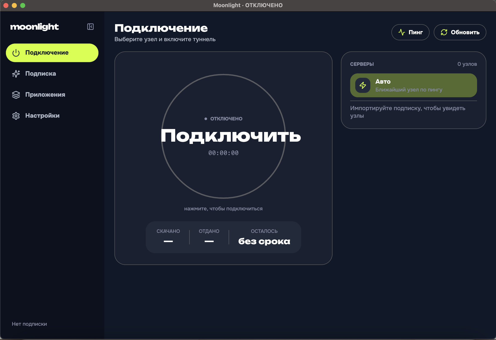

# Moonlight VPN — Windows

A Rust client built on **[mihomo](https://github.com/MetaCubeX/mihomo) 1.19.31**,
implementing the `Moonlight Desktop` design. Subscriptions come from a Remnawave
panel. Companion to [moonlightvpn_macos](https://github.com/kiineld/moonlightvpn_macos),
which is the same product in SwiftUI, and to
[moonlightvpn_android](https://github.com/kiineld/moonlightvpn_android), which is
the same product on Xray-core.



The screenshot is the real app, built and run from this repository — on macOS,
because iced runs there too. It is the same widget tree Windows builds, custom
title bar and all.

## The design is the source, not the screenshots

The tokens, the composition and every metric in this client come from the
Moonlight design system project, read directly rather than inferred from the
macOS build. That found real drift the Swift port had introduced:

| | Swift port | Design |
|---|---|---|
| Sidebar width | 248 | **236** (`--ml-rail-w`) |
| Collapsed rail | 72 | **76** (`--ml-rail-w-tablet`) |
| Input radius | 14 | **16** (`--ml-r-input`) |
| Icon tile radius | 13 | **12** (`--ml-r-icon`) |
| Card stack gap | 16 | **14** (`--ml-gap-stack`) |
| Selected row | 13% lime wash | **`--ml-surface-2`** |

The last one was the visible one. A selected server row painted with the accent
wash composites to a dark olive over the panel, and the composition uses it
nowhere: what carries the accent on a selected row is the row's **tile**, and the
row itself goes to surface-2. The port had the two exactly backwards.

The colour and motion tokens, by contrast, matched value for value — palette,
the four accent roles, all four bézier curves and all three press scales.

Two things the design specifies that only exist on Windows, and that the macOS
client therefore has no counterpart for: an 8px window radius rather than 12,
and a **custom title bar** — the logo, a left-aligned title with a status dot,
and this app's own minimise / maximise / close controls. A native Windows caption
is light grey with square corners against a `#0B111E` rail with 8px corners,
which reads as a different application wearing this one as a skin. Drawing it
means dragging and maximising become this app's job; `iced::window` provides
both.

Resizing, however, does **not** become this app's job, which is worth writing
down because the shape of the code suggests otherwise: nothing calls
`iced::window::drag_resize`, so the edges look unwired. They are not. winit's
`with_decorations(false)` drops the caption's *painting* but keeps
`WS_THICKFRAME` on the window, so Windows still hit-tests the border and
edge-drag resizing works natively — confirmed on Windows 11 by reading the style
bits off the live window. Adding hit-zones would duplicate what the OS already
does.

## Architecture

```
moonlight-design   colour/type/motion tokens, lucide icons, an SVG path renderer
moonlight-core     mihomo supervisor, RESTful API client, config builder,
                   subscription client, system proxy, helper protocol
moonlight          iced screens, view models, the app itself
moonlight-helper   the LocalSystem Windows service that runs the core in TUN mode
```

`moonlight → moonlight-core, moonlight-design` · `moonlight-helper → moonlight-core`.

One Cargo workspace, no solution file, no MSBuild. `scripts\build.ps1` fetches
the assets, builds the release binaries and lays out a portable folder.

Seven screens, all real: Connect, Subscription, Apps, Settings, Import, and the
Logs and Connections diagnostics screens.

### Why Rust and iced

The design is drawn entirely from scratch — there is not one native control on
any screen — so a retained-mode canvas toolkit costs nothing and buys pixel
control. iced also runs on macOS and Linux, which means the UI can be built and
looked at away from Windows, and `cargo check --target x86_64-pc-windows-msvc`
type-checks every `#[cfg(windows)]` block from any machine. That is why
`reqwest` uses **native-tls** rather than rustls: rustls pulls in `ring`, whose
C build breaks cross-checking, and on Windows native-tls *is* schannel, so a
corporate root the machine already trusts works with no CA bundle shipped.

### The data path

```
app traffic → WinINET proxy or Wintun → mihomo → VLESS/Trojan/SS node
                                          ↑
                          app ── RESTful API on 127.0.0.1:9797
```

The core is never reconfigured by restarting it. Switching a node, changing the
split mode, or loading a refreshed subscription all go through the API or a
config reload, so the tunnel survives every one of them.

## Two ways traffic reaches the tunnel

These are different mechanisms, not a preference.

| | System proxy | TUN |
|---|---|---|
| Privileges | none | Administrator, via a service installed once |
| Captures | apps that honour the WinINET proxy | everything |
| Per-app rules | **no** | yes |

### The system proxy needs more than a registry write

macOS's `networksetup` takes effect the moment it returns. Windows does not.
WinINET caches the proxy configuration **per process**, so an application that
is already running keeps going direct until it is told to re-read the settings.
`InternetSetOptionW(INTERNET_OPTION_SETTINGS_CHANGED)` followed by
`INTERNET_OPTION_REFRESH` is that broadcast. Without it the registry says
"proxied" while every browser already open is still going direct — which is
worse than failing, because the UI reports a tunnel that only captures
applications started afterwards.

Three smaller Windows specifics, each of which silently breaks the tunnel if
missed:

- **`AutoConfigURL` is cleared on connect and restored verbatim.** A PAC script
  takes precedence over the manual proxy settings, so on a machine configured by
  group policy the write would otherwise be a no-op.
- **`ProxyServer` names `http=` and `https=` explicitly.** The bare `host:port`
  form is read as HTTP-only by some applications, which leaves HTTPS going
  direct.
- **The bypass list uses `<local>`.** That is WinINET's own token for "any
  hostname with no dot". `*.local` is the macOS spelling and matches nothing
  here.

The previous settings are snapshotted before the first write and put back
verbatim on disconnect — a machine may already have had a proxy the user set by
hand, and restoring "off" unconditionally would silently delete it. The snapshot
is **persisted**, not just held in memory, because a crash that skips the
disconnect path otherwise leaves every browser pointed at a core that is no
longer running: the user sees "the internet stopped working" with nothing on
screen connecting it to this app.

### The helper's trust boundary

TUN needs Administrator — creating the Wintun adapter and installing
`auto-route`'s routes both do, and no manifest work changes that. Asking for a
UAC prompt on every connect is how people end up leaving TUN off, so the
privilege is taken once by a service and held.

A LocalSystem service taking instructions over a pipe is a privilege escalation
waiting to happen, so it is deliberately narrow — the same three rules the macOS
client's LaunchDaemon follows:

- **It never runs a path the client supplies.** The core is a copy made into
  `%ProgramData%\Moonlight` at install time, and that path is compiled into the
  service. The protocol has no field for naming another one, and there is a test
  that fails if one is ever added.
- **It never opens a config path the client supplies.** The client sends config
  *text*; the service writes it into its own directory — and unlinks first,
  because `File::create` follows an existing junction and would otherwise turn
  "start the tunnel" into an arbitrary LocalSystem file write.
- **The pipe's DACL is `D:(A;;GA;;;BA)(A;;GA;;;SY)`** — Administrators and
  SYSTEM, nothing else. That *is* the authentication: there is no token and no
  handshake because the kernel enforces the DACL on `CreateFile`. It is the
  counterpart of the macOS socket's `0660 root:admin`, and like it, it is not a
  boundary against an administrator and does not pretend to be.

The service is **AutoStart, not OnDemand**. The app is not elevated and cannot
start a stopped service, so on-demand would give TUN exactly one working session
per reboot and then fail silently with no way back without another prompt.

### The core cannot outlive the app

On macOS a child dies with its parent's process group. Windows has no such
relationship: an app killed from Task Manager leaves a core still holding the
controller port and still carrying traffic with no UI attached, and the next
launch finds a core it did not start — so every API call silently addresses the
old one. The child is therefore put in a **job object** with
`JOB_OBJECT_LIMIT_KILL_ON_JOB_CLOSE`, which makes the kernel terminate it when
this process exits for any reason, crashes included.

The core also runs with `CREATE_NO_WINDOW`: mihomo is a console application, and
spawning it normally puts a `conhost` window in front of the user for the life
of the tunnel.

### Updates

Once per launch the app asks GitHub, quietly: a failed check goes to the log,
and only a newer version reaches the screen, as a banner in the window's corner.
Clicking it opens Settings and starts the install there with its progress in
view — "12,3 МБ из 36,6 МБ", a bar, the version, and what the wait ends in; its
cross hides it until the next launch. The release's `Moonlight-Setup.exe` is
checked against the release's `SHA256SUMS.txt` (hashed with Windows' own CNG)
**before** the app quits, so a damaged download leaves the working version
running. The app then puts the machine back and quits, and Setup runs silently
(`/SILENT /SUPPRESSMSGBOXES`), through the shell so its elevation prompt shows:
it replaces the installation, rolls itself back if anything fails, keeps the
tasks chosen at first install, and starts the new version as the user. The old
zip route — a detached batch script unpacking over the install folder — is gone.

### The tray, one copy, and closing

The app is an iced *daemon*: it outlives its window. Closing the window (the ×
or Alt+F4) leaves it in the notification area; quitting is the tray panel's
own button or the icon's menu, and goes through the same shutdown that puts the
proxy settings back. The icon is raw `Shell_NotifyIcon` on a hidden top-level
window (`tray.rs`) — not a message-only one, which never hears the broadcasts
that say Explorer restarted or the taskbar changed theme. It is the logo's moon,
drawn in code: a crescent in the taskbar's ink while the tunnel is down, the
full moon in lime while it is up. Its balloons carry the expiry and low-traffic
warnings, each sent once and only with the switch on.

A left click opens the tray panel — state and speeds, rules / global / direct
(patched into the running core; global points mihomo's `GLOBAL` at the app's
selector), a searchable server list with a ping per row, and a connect button —
which closes when it loses focus unless pinned. The panel's window is made once,
hidden, and only shown and put away after that, so it is there the moment the
icon is clicked; it is placed against the icon itself rather than the taskbar,
so that with the icon in the hidden-icons flyout it sits above the flyout
instead of over it. A right click opens the menu every other icon there has:
open, connect or disconnect, quit.

Only one copy runs (`instance.rs`): a named mutex marks the first, and a second
launch passes its request — show the window, or a link — down a per-user pipe
and exits before touching anything. A second copy used to find the first one's
core, take it for a leftover and stop it. A sign-in launch carries
`--autostart` and starts in the tray; the Run entry is rewritten at launch so an
older one gains the flag.

### When TUN cannot start

`auto-route` installs routes covering the internet, and another VPN client
holding them makes the core log a `Start TUN listening error` and then **keep
running** — answering its API normally with no interface established, so every
other signal says "connected" while nothing is routed. The connect path checks
the log for that line before reporting success, and names the cause rather than
quoting the core. The Windows-specific case, a Wintun adapter that could not be
created, points at the privilege it needs instead of the API call that failed.

### Browsers on secure DNS

A browser with secure DNS on — Chrome's "Use secure DNS" with Google or
Cloudflare — resolves names itself, over HTTPS, past the core's DNS. In TUN its
connections then reach the core as **bare addresses**: the fake-ip table has
nothing to map back, so no `DOMAIN-SUFFIX` or `GEOSITE` rule can match. Every
one fell through to the catch-all and went to the server as an address — the
`.ru` sites the subscription sends `DIRECT` included, and IPv6 addresses the
core's own DNS never hands out — and the browser showed `ERR_CONNECTION_CLOSED`
wherever the far end could not carry that. The connections page listed
addresses instead of hosts.

So the config always carries a **sniffer**: the core reads the name from the TLS
ClientHello, the QUIC Initial or the HTTP `Host` header, routes on it, and dials
the name rather than the address (`override-destination`), so the server
resolves it the way it can reach it and a `DIRECT` connection resolves it
through the subscription's DNS. A subscription that switches its own sniffer on
keeps it; one with none, or with one switched off, gets the app's. The
connections page shows the core's `sniffHost` before falling back to the
address. The block is the macOS client's, value for value.

## Rules

The rules page replaces the apps screen and its split modes, as on macOS and
modelled on Flowvy's "Мои правила" (`rules.rs`). A rule of the user's own
matches with mihomo's grammar and sends what it matches to `DIRECT`, `REJECT`
or one of the subscription's groups:

| Kind | |
|---|---|
| `DOMAIN` `DOMAIN-SUFFIX` `DOMAIN-KEYWORD` `DOMAIN-REGEX` `GEOSITE` | by host |
| `IP-CIDR` `IP-CIDR6` `IP-ASN` `GEOIP` `SRC-IP-CIDR` | by address |
| `DST-PORT` `SRC-PORT` | by port — one, a range `1000-2000`, or several joined by `/` |
| `PROCESS-NAME` `PROCESS-PATH` and their `-REGEX` forms | by program — the name *with* `.exe`, which is what mihomo reads back |
| `NETWORK` | `tcp` or `udp` |

**Override** puts a rule before the subscription's rules; **Extend** puts it
after them but before their catch-all `MATCH`, where it can still match.
Rules can be switched off, edited, deleted and dragged into order, and stay a
draft until **Apply**, which has the core check the resulting config with
`mihomo -t` first: one rule the core refuses takes the whole config down with
it, so a refused set is not kept. Values are validated as they are typed —
regexes compiled, ports and CIDRs parsed as real values in their own family,
commas refused because mihomo splits a rule on them.

A rule pointing at a group the subscription has dropped is skipped rather than
written, and shown in red. `PROCESS-*` rules need the core to know the program
behind a connection, which only TUN gives it, so they are written only in TUN.
An `IP-ASN` rule needs mihomo's ASN database, which ships beside the other two
and is fetched when a build lacks it — left to the core, it would download it
while parsing, through a resolver not yet working, and refuse the config.

The editor's program picker lists running programs, then installed ones, with a
filter. A second tab lists the subscription's own rules to read. On the first
launch after the apps screen, what was set there is carried over as rules: "all
but these" to `DIRECT`, "only these" to the subscription's group, "all traffic"
switched off — and the old settings are forgotten.

## Subscriptions

Remnawave serves a subscription in six shapes, chosen by a path suffix. The
order this client tries them is load-bearing:

1. **`<url>/mihomo`** — a Clash.Meta config written by the panel operator. It can
   carry proxy groups, a `url-test` balancer across a dozen nodes, its own DNS
   and routing rules.
2. **`<url>/clash`** — the same idea for stock Clash.
3. **The bare URL** — base64 or plain share links, one URI per node. Every group,
   balancer and routing rule is flattened away by that format, so a node whose
   panel entry was a balancer arrives as a single unusable placeholder.

The panel's document is then kept **verbatim**. The config builder overrides only
what the client must own — the API address and secret, the local port,
`allow-lan: false` and a loopback bind, the TUN block, the split rules, and a
sniffer where the panel has none on (see *Browsers on secure DNS*). A
panel that ships a `geosite:category-ru → DIRECT` rule means it, and its tuning
is usually better than anything generated here.

Share links are still parsed for `vless://`, `vmess://`, `trojan://` and `ss://`
so the third path produces something usable. A Reality node with no `pbk` is
dropped there rather than passed on, because mihomo refuses the whole config
rather than skipping one node.

The subscription request carries Remnawave's device headers:

```
x-hwid:         <derived from the machine, see hwid.rs>
x-device-os:    Windows
x-ver-os:       <system version>
x-device-model: <machine model>
```

The HWID is the machine's `MachineGuid` hashed into a UUIDv5 under the app's own
namespace, so a reinstall is the same device to the panel and the hardware's own
identifier never leaves the machine.

### Response headers

Every Remnawave header is read, and takes precedence over `<url>/info` field by
field: `subscription-userinfo`, `profile-title`, `announce` (a banner the user
can put away, per message), `profile-web-page-url`, `support-url` (Support opens
it when sent), `profile-update-interval` and `subscription-refill-date`. Text
values may be plain or `base64:`; links are kept only with an expected scheme.
A missing field reads as *unknown* rather than zero — a plan whose panel omits
`total` is unlimited, and showing "0 GB" for it would be a lie the user acts on.
"Never expires" (a date in 2099) reads as no expiry, in the header and in
`/info` alike. The account's username is not read.

At the device limit the panel answers **200 with an empty body** and
`x-hwid-max-devices-reached: true`; that is reported as the limit, with the
service's own `announce` when it sent one, not as an empty subscription.

### Cache and auto-update

The subscription as last fetched is kept in `subscription.yaml` beside the
preferences, with the plan it described. Launch runs the core from it straight
away, so the app connects whether or not the service answers today, and fetches
again only when the schedule says so: off, or every 1/6/12/24 h, defaulting to
the service's `profile-update-interval`. The app asks every five minutes, which
also catches up after sleep. Every refresh reloads the running core. A new link
replaces the current one only once it has loaded.

### Nothing about the service on screen

Errors reach the screen as typed issues (`issue.rs`) worded by the app in both
languages — never "Panel returned HTTP 502". The log masks the subscription
link, its host and token, and every server address (`redact.rs`), in the app's
lines and the core's alike, and transport errors are logged without their URL.

### `moonlight://` links

`moonlight://install-config?url=<link>` — the form Clash clients use — and
`moonlight://import?url=…` / `moonlight:///import?url=…` add a subscription
(`deeplink.rs`). The nested link should be percent-encoded; one that is not is
still read to the end, `&` and all, and only http(s) links are taken. The scheme
is registered under `HKCU\Software\Classes\moonlight` at every launch, so it
follows the app wherever it lives. A link Windows opens starts a second copy,
which hands it to the running one and exits. A link never adds anything by
itself: the app comes forward and asks, saying whether it would replace or
update the current subscription, and never shows the link.

### The subscription client ignores the system proxy

`reqwest` is built with `no_proxy`, and that does more work here than the
equivalent does on macOS: reqwest's default proxy comes from
`HKCU\…\Internet Settings`, which is the *exact key this client writes* when it
connects. Without it, a refresh during a half-open tunnel sends the panel
request back through the tunnel it is managing and hangs with no timeout —
the connection is established and simply never answered.

## Latency probing

Measured through the running core's `/proxies/{name}/delay` against
`http://cp.cloudflare.com/generate_204`, so each probe uses that node's own
outbound. The same target drives the `url-test` group this client injects.

**http, not https**, and Cloudflare rather than Google: the probe is timing the
path to the node, and a TLS handshake to the *target* adds a round trip that says
nothing about it. Cloudflare answers `204` with an empty body from a global
anycast address, so the number is about the node rather than about which
continent the target sits on. The core multiplexes the probes, so a full pass
costs about as long as its slowest node rather than the sum; concurrency is
still capped, because a subscription with sixty nodes would otherwise open sixty
handshakes at once and measure congestion instead of latency.

Results are applied **as each node answers** rather than at the end of the pass.
A pass over twenty nodes takes several seconds no matter how it is written — the
dead ones have to time out — so reporting each result as it lands is what makes
it feel immediate: the fast nodes, which are the ones being chosen between,
appear straight away instead of behind the slowest entry in the list.

Numbers are kept in `preferences.json`, so they survive a screen change, a
reconnect and a relaunch. A node that stops answering **loses** its number
rather than keeping a stale one that is no longer true.

An unreachable node reads **n/a**, not an error and not a dash: a timeout is the
expected answer for a node that is down, and "not measured yet" is a different
thing worth telling apart from it.

## State

`%APPDATA%\Moonlight\preferences.json`, not the registry. The state is nested —
a list of rules, a map of latencies — where the registry is flat, and a portable
build should not leave a machine-wide trace. It is written to a temporary file
and renamed, so a crash mid-write leaves the previous preferences rather than a
truncated file, and a file from a newer build or a half-written one falls back to
defaults rather than stopping the app from starting.

## Geodata

Not shipped. mihomo downloads `GeoSite.dat`/`GeoIP.dat` on demand into
`%APPDATA%\Moonlight\core\` the first time a config references a
`geosite:`/`geoip:` rule, which every panel config does. That costs one download
on first connect and saves ~24 MB in the download.

## Design system

Tokens map one-for-one from the source CSS, and are identical to the macOS
client's down to the hex literals. Dark is lime `#D2FF1F` on slate `#101828`;
light flips the accent to yellow `#FFE078`. The accent splits into four roles
that must stay distinct, because light mode depends on it:

- `accent` — fills (buttons, the dial sweep, active pills)
- `accent_ink` — accent as type or a glyph (`#EFAE2E` in light)
- `accent_ink_strong` — accent type sitting *on* an accent wash
- `accent_line` — accent as a thin mark (bars, dots, rings)

Icons are **lucide 0.468.0**, the set the design is drawn with, carried across as
raw SVG path data rather than redrawn, so stroke geometry is identical to the
macOS build's. The path parser handles the whole `d` grammar — `M L H V C S Q T
A Z`, absolute and relative, with arcs converted to cubics — because getting a
smooth curve or an arc wrong shows up as a visibly wrong glyph rather than as an
error.

Fonts are Onest (UI/body), Unbounded (display) and JetBrains Mono (figures, the
log), embedded in the binary with
`include_bytes!` rather than registered from a bundle: a portable `.exe` has
nowhere to register from, and a build that silently fell back to Segoe UI would
not look like this product. They are fetched as **static instances** — one file
per weight, cut from the variable TTF with `fonttools` — rather than registering
the variable file and asking for a weight. Weight selection then does not depend
on how completely the shaper underneath iced supports variable axes, which is a
detail that can change under you between releases and whose failure mode is
silent: the type hierarchy flattens and nothing errors.

The connect dial's ring is **full when connected** and sweeps closed as it
connects. It used to show remaining quota, which meant a perfectly healthy
tunnel drew a ring with a gap in it — and a gap in a status ring reads as a
fault, not as "you have used some traffic". The quota has a bar of its own in the
sidebar, where a partial fill is the point.

The two figures under the dial are what is **left** — traffic and time — rather
than what the session has spent. Session byte counters are the least actionable
numbers on the screen; how much plan remains is what people open the app to
check.

The sidebar collapses to a 72pt icon rail; the wordmark is the toggle.

### Glass, and what it takes on this renderer

The surfaces are the macOS client's Liquid Glass translated, not its flat
fallback: `surface` and its steps are translucent washes over the canvas (and,
through Mica, the desktop), lit from above by a gradient, rimmed with a hairline,
and in the light theme lifted by a soft shadow — white glass on an off-white
canvas. What has to hide the page under it (a menu, a dialog, the sidebar) takes
the solid `raised` or `rail` instead. `theme.rs` has the three shapes: `glass`,
`control`, `floating`.

Three things about iced decide whether that looks and moves right, and none of
them announces itself:

- **`web-colors` is on.** Without it the renderer blends in linear light, where
  a 10% white hairline over black comes out a third grey and a 10% black one
  over white all but vanishes — every wash and hairline in the palette at the
  wrong weight, in opposite directions in the two themes.
- **A canvas cache lives in the widget's state, not in the program.** The view
  is rebuilt for every frame, so a `Cache` held in the `Program` struct is a new,
  empty one each time: every icon on screen was being parsed and tessellated
  again on every frame.
- **Animations tick on `window::frames()`, not a timer.** One tick per frame the
  display shows — 144 on a 144 Hz screen — where a 16 ms timer was out of step
  with every refresh rate.

Two more for anything long: a list of same-height rows builds only the rows in
view (the subscription's rules), and core log lines wait in a buffer rather than
each being a message — a message redraws the window, and a connected core writes
a line per connection.

### Page changes do not cross-fade

Deliberately, and for the same reason as on macOS: every transition tried keeps
the outgoing screen in the tree for the length of the animation, so the previous
page shows *through* the new one and reads as a blink.

### Two iced traps worth knowing about

Both produce the same error — `implementation of FnOnce is not general enough`,
pointing at the whole builder chain and naming neither cause:

- A closure with an un-annotated reference parameter (`.theme(|_| …)`) is
  inferred at a single lifetime, where iced's `view` bound is higher-ranked. Pass
  a `fn` item instead.
- `iced::application` returns an opaque `Application<impl Program>`. Binding it
  to a `mut` local to register fonts in a loop — or threading it through a
  `fold` — pins that opaque type at one lifetime and reproduces the error. The
  whole chain has to stay one expression.

## Building

On Windows, with Rust stable and Python 3 (for `fonttools`):

```powershell
python -m pip install fonttools
.\scripts\build.ps1
```

That fetches the fonts and the core, builds release binaries and lays out
`dist\Moonlight`. The core and `wintun.dll` sit *beside* the app rather than
being embedded, because the helper's `--install` copies the core out of that
folder into `%ProgramData%`.

From macOS or Linux, to type-check the Windows-only code without a Windows
machine:

```bash
rustup target add x86_64-pc-windows-msvc
cargo check --workspace --target x86_64-pc-windows-msvc
```

The UI itself builds and runs natively on macOS and Linux too, which is how it
was developed:

```bash
scripts/fetch-fonts.sh
cargo run -p moonlight
```

## Tests

```bash
cargo test --workspace
```

**294 unit checks**, which run on any platform — only the functions that touch
the registry, the service and the shell are stubbed off Windows, and the stubs
return failure rather than success so a test cannot claim a tunnel it never
established.

They cover the parts where correctness is not visual: `subscription-userinfo`
parsing (partial, malformed, absent, zero-means-unlimited), share-link metadata
across four schemes, URL normalisation (a `file://` or `vless://` link must not
be rewritten into a plausible `https://` one), config assembly, all three split
modes and every rule kind, the SVG path grammar including the arc and
smooth-curve cases, Russian's three-way plurals, version comparison, the update
script's restore paths, and the helper protocol — including a test that fails if
a path field is ever added to it.

Two of them build **every screen's widget tree** in the empty and the populated
state, and again in light mode and English. A `view` that panics on an empty list
does so the moment a user navigates to it, which is the worst place to find out.

### The integration suite

```bash
MOONLIGHT_MIHOMO=/path/to/mihomo cargo test --test integration -- --test-threads=1
```

Skipped, with a note, when the core is not present — a developer without it
checked out can still run `cargo test`.

It runs the **real mihomo binary**. Every config shape this client can produce
goes through `mihomo -t`, and one is started for real so the RESTful API — the
app's entire control channel — is exercised rather than assumed: the selector is
read, a node is switched, connections and totals are fetched, and the config is
reloaded in place.

The load-bearing case is **every rule kind in both positions**, as a plain rule
and inside the `SUB-RULE` matcher that "only these" mode uses. mihomo accepts
different grammars in the two, and it refuses the *whole config* for one bad
rule — so a kind that works in one position and not the other is a tunnel that
stops, not a rule that is skipped.

TUN configs are validated but never started, because a test suite must not ask
for Administrator or create a network adapter.

On Windows, CI additionally runs tests that touch the machine itself: the
registry proxy is written and restored (and the restore is asserted, because a
test that leaves a machine proxied at a dead port is worse than no test), the
service is installed, pinged over its named pipe, sent a config it must refuse,
and uninstalled, and the app inventory is checked against the real Start Menu.
Those are opt-in behind `MOONLIGHT_ADMIN_TESTS=1`: they change machine state,
which is fine on a runner that is thrown away and not on a laptop.

## What is not done yet

An honest list, not a roadmap.

- The installer registers the TUN service itself, but **no one has run it end to
  end on a clean machine**: it compiles and produces a setup binary, and the
  service registration it performs is the same `--install` the app has always
  called, but an install onto a machine that has never had Moonlight on it has
  not been watched.
- **The tunnel has still not been run interactively on Windows.** The UI now has
  been: the app has been built and driven on real Windows 11 hardware, and every
  screen that does not need a subscription — Подключение, Приложения, Настройки —
  has been looked at and corrected against the composition. What has *not*
  happened is a live session: no tunnel has been brought up carrying a machine's
  own traffic, the system-proxy registry round trip has not been watched through
  a connect/disconnect, and TUN has never created a Wintun adapter, because CI
  validates those configs without starting them. The Подписка screen has only
  been seen in its empty state, since populating it needs a real subscription.
- The in-app update has been proven up to the hand-off: the latest real release
  downloads and matches its own `SHA256SUMS.txt` (`MOONLIGHT_NETWORK_TESTS=1`).
  Setup running silently and reopening the new version has not yet been
  watched; a throwaway release is the way to see it.
- **The Подписка screen is still the odd one out.** The macOS client always draws
  the plan card, the traffic bar and the device list, reading zeroes before a
  subscription exists; this one collapses to a single "Добавить подписку" row.
  Everything else — the rail, the dial, Приложения, Соединения, Настройки — has
  been matched against that client screen by screen on real hardware.
- Connect-on-launch is specified by the composition and is **not** implemented.
  A switch that flips and changes nothing is worse than an absent one.
- Соединения has no search field yet; the macOS client filters the list from one.
- **The app is unsigned,** so SmartScreen warns on first run. That needs a
  code-signing certificate bought from a CA; no build configuration substitutes
  for one. The release workflow signs both executables when `SIGNING_CERTIFICATE`
  (a base64 `.pfx`) and `SIGNING_PASSWORD` are set as repository secrets, so it
  is one secret away. An EV certificate clears SmartScreen immediately; an OV one
  only once the binary has built reputation.
- Reconnect-on-network-change is not implemented.

## Licence

MIT — see [LICENSE.md](LICENSE.md), which also lists the third-party components.
